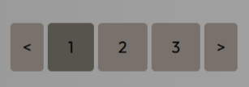

# MINI ORDERS APP

App full stack para agregar, editar y eliminar ordenes y verlas en una tabla

## Como usar la app

Luego de tener el repositorio en su equipo localmente.

### Frontend

abrir en una terminal el directorio raiz del proyecto
ejecutar los siguiente comandos en la terminal
``` cd frontend/ ```
``` npm install ```
``` npm run dev```
URL: http://localhost:5173/


### Backend

abrir en otra terminal diferente el directorio raiz del proyecto
``` cd backend/ ```
``` dotnet run ```
url para acceder a swagger http://localhost:5068/swagger/index.html


## Que fue lo mas dificil del reto y como lo resolvi?

Sin duda tener que adaptarme a un nuevo framework(vue),ya que uso react.Lo resolvi leyendo y buscando documentacion de como la forma en que se manejan los componentes en vue y busque equivalente en vue como ref es como useState para manejo de estado y asi fui viendo la manera de hacer lo que haria en react pero con vue.Otra cosa dificil del reto es que a medida que iba realizando el reto el codigo crecia mucho
y se me complico un poco al no conocer demasiado vue en su organizacion al pasar props, emit() para pasar de hijo a padre asegurandme que los datos se pasen correctamente.

## Ejemplos de uso


Permite viajar una pagina atras,una adelante o cualquiera al hacer click en cualquier numero para ver las ordenes


